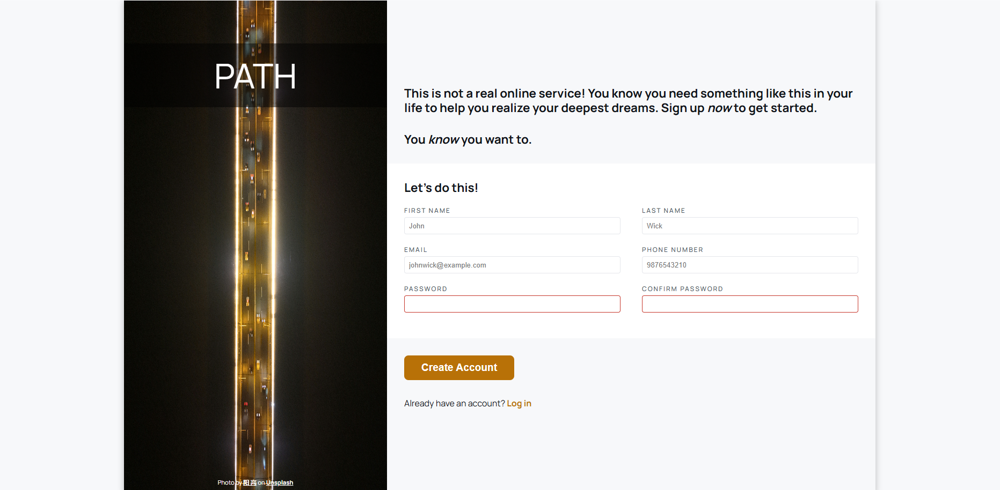

# sign-up-form

A static sign-up form page built using semantic HTML and modern CSS, based on a provided design reference.
The project focuses on layout structuring, form styling, and visual validation states without relying on JavaScript.

This is not a __real service__ and does not perform actual account creation.

## Live Demo
[View on GitHub Pages](https://sai-eshwar-supreet.github.io/sign-up-form/)

## Design Reference

## Preview

## Features
- __Semantic form structure__
    - Inputs grouped using `<fieldset>` and `<legend>`
    - Proper labels and required attributes
- __CSS-only validation states__
    - Invalid inputs highlighted using the `:invalid` pseudo-class
    - Focused inputs styled using the `:focus` pseudo-class
- __Password constraints__
    - Minimum length enforced
    - Whitespace disallowed via `pattern` attribute
- __Dark mode support__
    - Color system adapts automatically using prefers-color-scheme

## What I Practiced
- Structuring layouts using Flexbox
- Designing and maintaining a reusable CSS variable system
- Form styling and validation using HTML and CSS
- Using semantic HTML elements for accessibility and clarity

## Technical Notes
- __Layout__
    - The main layout is handled using a flex container with a fixed image sidebar and flexible form area
    - The image sidebar is hidden on smaller screens to simplify layout
    - Almost all of the responsive design is done with the help of math function instead of media queries
- __Form organization__
    - Inputs are grouped using `<fieldset>` for logical separation
    - Legends are visually hidden but preserved for accessibility
- __Validation__
    - Client side validation is done with HTML and CSS
- __Styling__
    - A centralized CSS variable system controls colors and themes
    - Focus styling uses `outline` instead of borders to avoid layout shifts

## Limitations & Trade-offs
- Password confirmation matching is not implemented, as JavaScript validation was outside the assignment scope
- The layout is not optimized for mobile devices, per assignment instructions

No form submission handling or backend integration is included

## Acknowledgements
- Background image by **[阳 高](https://unsplash.com/@plutohard?utm_source=unsplash&utm_medium=referral&utm_content=creditCopyText)** on Unsplash
- Custom font (**[Manrope](https://fonts.google.com/share?selection.family=Manrope:wght@200..800)**) loaded via Google Fonts
- This project was completed as part of **[The Odin Project – Intermediate HTML & CSS Course](https://www.theodinproject.com/)**

